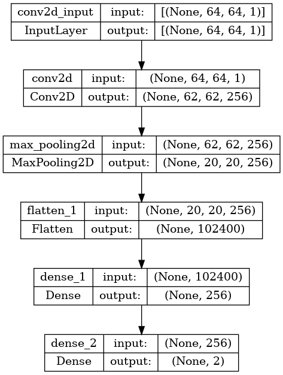
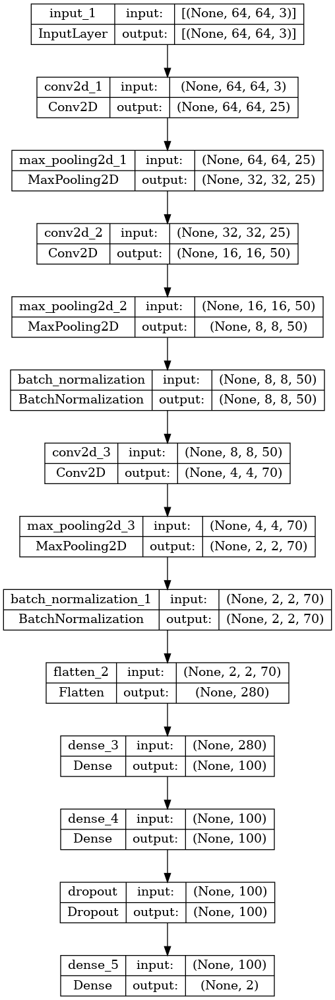
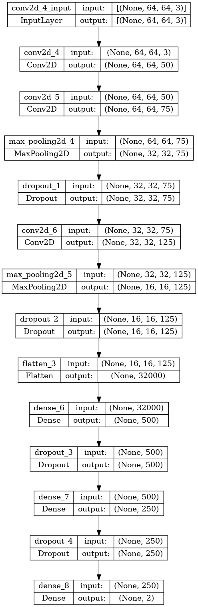
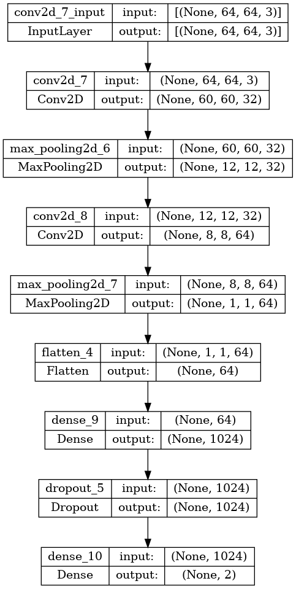
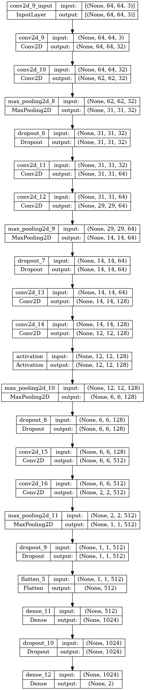
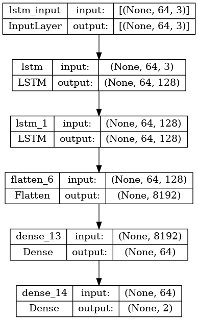
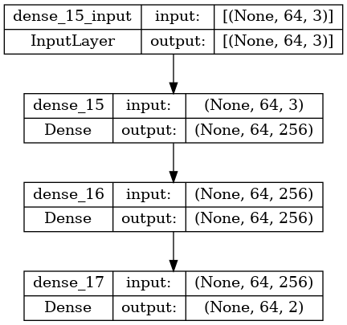
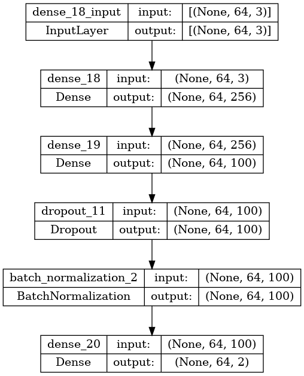

# Medical Image Multi Label Classification
#### Student: Lucian Istrati - 511 - Data Science
#### lucian.istrati@s.unibuc.ro 
#### lucian.istrati@my.fmi.unibuc.ro

## Introduction

The task at hand is to be able to perform three classification for any scan image. Each image has 3 binary labels associated with it. 

Classifying medical images is a problem most commonly dealed with by using convolutional neural networks, as an example can be seen in the paper of Yadav et al here: https://journalofbigdata.springeropen.com/articles/10.1186/s40537-019-0276-2. 

The scores on the public leaderboard as well as the metrics chosen by myself for the training regime was F1 score. 

There are also two primary ways in which this classification can be tackled: one single neural network with 3 classification downstream tasks and one with 3 different neural networks with 3 different training (for this project I went only for the latter one).

## Dataset Analysis

The images are split across the datasets in the following manner:
- 12.000 images in the training set;
- 3.000 images in the validation set;
- 5.000 images in the testing set.

In order to load the data we call:
- load_data() from main.py in order to load the images;
- load_labels() from main.py to load the labels for the images from training and validations sets;

Some observations about the data:
- images are 64 by 64 by 3, but since they are grayscale we can use a 64 by 64 by 3 or 64 by 64 by 1 images for models training.
- at a first close look through the data many images that were totally black were observed, because of this I decided to investigate how many of these black images were there in total. In total, 5000 black images were found. Since there were this many black ones I also searched for other possible duplicates in the dataset between normal images, but none were found. Trainings were done both without most of these 5000 black images, except for one with a 0 label on each task and with a 1 label 
  on  each 
  task. Also, this 
  quarter of the dataset was 
  labelled 
  with both 
zeroes and ones.
- one quarter of the images are black (4985 out of 15.000). 
- A removal of all black images except for one image was performed.

### Labels distribution

- Training set first task:
- 
- Validation set first task:

- Training set second task:
- 
- Validation set second task:
- 
- Training set third task:
- 
- Validation set third task: 
- 

### 1. Convolutional neural network model. Five architectures were tried out for this type of model as this one proved to yield the best results from the start out of the 3 types of models:
- 1.a 

- 1.b 

- 1.c

- 1.d

- 1.e

- Convolution neural networks are different from vanilla fully connecte neural networks because of the convolutional and pooling layers. 
- Convolutions work by sliding a filter (which must be smaller than the original image, otherwise we are performing a deconvolution instead of convolution) and when sliding the filter we are essentially multiply term by term the filter with a subimage of the original image and then we add it up (so essntially a scalar product that leads to downsizing the 
  image in order to increase the amount of information contained per pixel in the image). 
- These convolutions are then followed by max pooling operations which lead to choosing the maximal value of pixels from continuous subimages slided from the original image.

### 2. Recurrent neural network model. Only one architecture was tried out for this type of model.

- Recurrent neural networks were developed as a need to model sequential data sampled as points in time, so generally speaking is less suitable for image and more appropriate for time series data. 
- Long short term memory layers in an RNN are a particular type of rnn cell where each cell has the following gates: a forget one (which controls how much information is deleted onto the next cell), an input one (which control how much information is the cell receiving from the previous one), an 
  output one (which controls how much information is 'spitted out' to the next cell) and an modulation one (which controls how much information gets preprocessed).

### 3. Fully connected neural network model. Two architectures were tried out for this type of model:
- 3.a

- 3.b

- Fully connected neural networks are models comprised of multiple layers of perceptrons alligned in deep depths in order to captures as many non-linearities as possible. 
- There are many tweaks that can be done to this tpe of neural networks such as: dropout layers which drop neurons in order to increase the robustness of the network or batch-normalization to perform the normalization at batch level at an intermediary layer.

cnn 2 is also 89% smth, as rnn lstm is 89% smth as well

Tried out some augmentations, such as the following:
- Rotate - rotate an image up to a certain degree 
- Flip - flip an image horizontally or vertically
- Shear - shear an image
- Scale - downsize an image or upsize it
- Pad - add padding to the borders of a image
- Blur - blur an image and make it more fuzzy
- Crop - crop parts from an image
- CutOut - crop and extracts the parts from the image (like a masking of inside pixels)

This is an example of how these augmentations turned out to look like:
### Original image:
- 

### Augmented images:
- 
- 
- 
- 
- 
- 
- 
- 
- 
- 

There were no substantial differeneces or improvement after performing augmentations of the dataset.

### Number of epochs choices:
- 5 - around 5 or +/-3 epochs it was underfitting;
- 10 - best results (above this, it went into overfitting);

### Learning rate choices: 
- 1e-3 - best results
- 1e-2 - worse results
- 1e-1 - worse results

### Optimizer choices:
- Adam - better results
- SGD (Stochastic Gradient Descent) - worse results

### Loss function choices: 
- Binary Crossentropy - insignificant differences
- Categorical Crossentropy - insignificant differences

### Metrics function choices:
- F1Score - final choice as the kaggle metric was also this one
- Accuracy - no significant difference, but went for F1 since it was also used on kaggle

### Data preprocessing techniques:
- resizing from (64, 64, 3) to (64, 64, 1)
- normalization by dividing to 255
- downsizing to (32, 32)
- converting the images to float32 precision

### Submitting
In order to then create a submission file we call:
- create_sample_submission() from main.py 

#### Methodology 

## Experiments

The experiments were mainly about experimenting with the three types of architectures: fully connected, recurrent and convolutional by varying the learning rate, optimizer, loss function, number of epochs, batch size and depth of the network.

| Model    | Average Precision |
|----------|-------------------| 
| FCNN-1   | 0.86              |
| FCNN-2   | 0.86              |
| RNN-1    | 0.89              |
| CNN-1    | 0.87              |
| CNN-2    | 0.87              |
| CNN-3    | 0.89              |
| CNN-4    | 0.85              |
| CNN-5    | 0.91              |
| -------- | --------------    |
## Future works

A possible future wor could be to try out some other more advanced transformers based architectures or deeper architectures such as Efficient Net, VGG or AlexNet. 

Maybe some other augmentations could be tried out as well. 

Of course, new sources of data could also improve the performance as the dataset at hand is quite small for a task where high performance can be obtained mostly with large convoluted neural networks. 

## Conclusion

In the src folder there are five py files:
- data_analysis.py - where some analysis is performed on the dataset
- main.py - the main on which the other files rely on
- network_visualizer.py - functions necessary for creating the plots of the NNs architectures
- solt_augmentation.py - image augmentation is located
- train_neural_net.py -  util functions for training various neural networks

To conclude, convolutional neural networks proved to yield the best results when compared to recurrent neural networks with long-short-term memory or other more simple fully connected neural networks. 

Also, out of the 5 cnn tried out architectures the deepest one prooved to yield the best results overall managing to achieve a public score of 0.915 and a private sore of 0.907, so a difference of about 0.8% between the public and the private scores.

## References 

https://www.analyticsvidhya.com/blog/2020/02/learn-image-classification-cnn-convolutional-neural-networks-3-datasets/
https://www.antoniofurioso.com/artificial-intelligence/convolutional-neural-network-what-it-is-and-how-it-works/
https://towardsdatascience.com/inside-convolutional-neural-network-e1c4c1d44fa2
https://medium.com/analytics-vidhya/an-overview-of-convolutional-neural-network-cnn-a6a3d67ce543
https://www.analyticsvidhya.com/blog/2022/03/basics-of-cnn-in-deep-learning/
https://medium.com/analytics-vidhya/understanding-neural-networks-from-neuron-to-rnn-cnn-and-deep-learning-cd88e90e0a90
https://www.analyticsvidhya.com/blog/2022/01/convolutional-neural-networkcnn/